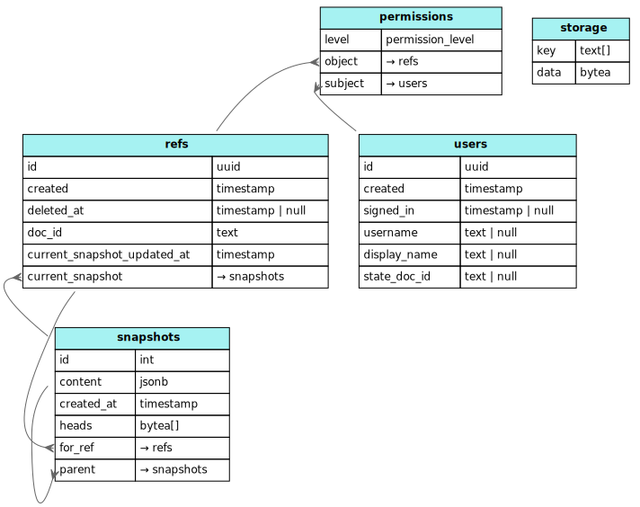

# CatColab backend

This directory contains the web server for the CatColab application, written in
Rust using the [`sqlx`](https://github.com/launchbadge/sqlx) bindings for
PostgreSQL and the [`axum`](https://github.com/tokio-rs/axum) web framework.

You can find the auto-generated documentation for this Rust crate at [next.catcolab.org/dev/rust/backend/](https://next.catcolab.org/dev/rust/backend/).

## Setup

1. Install Rust, say by using [rustup](https://rustup.rs/)
2. Install and run PostgreSQL and create a new database named `catcolab`
    - (E.g. by using Docker)

    ```sh
    docker run --name catcolab-postgres -e POSTGRES_USER=catcolab \
        -e POSTGRES_PASSWORD=password -e POSTGRES_DB=catcolab -p 5432:5432 -d postgres:15
    ```

4. Change to the migrator directory: `cd ../backend`
5. Copy the .env.development to both folders (`cp .env.development .env && cp .env.development ../migrator/.env`) and update the `DATABASE_URL` variable with
   database username, password, and port. (If you used the above Docker command _as is_ it should already be correct.)
6. Run the initial database migration: `cargo run -p migrator apply`
7. Generate the TypeScript bindings for the RPC API: `cargo run generate-bindings`
7. Build the backend binary: `cargo build`
8. Run the unit tests: `cargo test`

## Usage

To run the backend locally, run the following commands:

```sh
cd packages/backend
cargo run
```

The backend is now running locally.

To run the integration tests for the RPC API:

```sh
cd packages/frontend
pnpm run test
```

To launch the frontend using the local backend:

```
cd packages/frontend
pnpm run dev
```
## Database schema



https://catcolab.org/analysis/019c28c7-5b0a-7ee3-a83b-6c1d32892047

### permissions

This is how we handle access control.

### storage

This is used for Automerge document storage and is completely independent from the rest of tables.

### refs

These are references to documents, referring to them by their latest snapshot: the `head`. If `deleted_at` is set then this document is soft deleted. We do not hard delete documents in normal usage.

### users

This table refers to our users. We use Firebase so our `id` in this table are Firebase user IDs. We also store a unique username for them when the user sets it.

### snapshots

These are timestamped snapshots of the Automerge document. We current only ever use the latest snapshot.


## Running migrations

This package runs databaes migrations using `migrator` subcommand which uses the
[sqlx_migrator](https://github.com/iamsauravsharma/sqlx_migrator) framework.

### Usage
The migrator tool can be run from any directory using the `cargo run -p backend migrator ...` command.
The migrator tool uses the default CLI interface provided by `sqlx_migrator`, which is very similar to
the `sqlx` CLI.

The `DATABASE_URL` environment variable must be set for the target database. This is typically configured
automatically by the Nix dev shell defined in the repository's `flake.nix`.

To view available commands, run

```sh
cargo run -p migrator help
```

To apply all migrations, run

```sh
cargo run -p migrator apply
```

## Writing new migrations

For migrations that consist solely of SQL statements, the easiest way to get started is to copy the first
migration file: `src/migrations/m20241004010448_document_refs.rs` and modify it as needed.

Be sure to register your new migration in `src/migrations/mod.rs`.

To generate a timestamp for the migration filename, run:

```sh
date -u +"%Y%m%d%H%M%S"
```

Don't forget to run `cargo sqlx prepare` in `packages/backend` after making schema changes!

